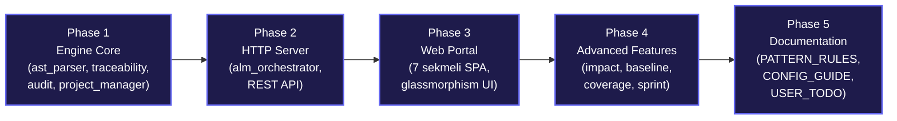

# Ludus Magnus Custom ALM v2 — Uçtan Uca Devreye Alma Planı

**Hedef:** ASPICE Level 3 uyumlu, çoklu proje destekli, offline-first, web tabanlı Application Lifecycle Management platformunun sıfırdan implementasyonu.

**Referans:** Codebeamer ALM (PTC) — Impact Analysis, Baseline, Audit Trail özellikleri

---

## Mevcut Durum

| Öğe | Durum |
|-----|-------|
| Implementasyon kodu | ❌ Sıfır (tamamen sıfırdan yazılacak) |
| Referans proje | `3_UE5_ProjectCult` — Şu an sadece VD + GDD tamamlandı |
| Gelecek büyüme | NDD, ADD, TDD, PBI dokümanları oluşturulacak → node sayısı önemli ölçüde artacak |
| Varsayılan port | **8002** (8000 portunda sorun yaşanmıştı) |

---

## Proposed Changes

### Mimari Genel Bakış

```
C:\repo\7_CustomALM\
├── alm_orchestrator.py              # Ana giriş (CLI + HTTP Server, port 8002)
├── projects.json                    # Çoklu proje kayıt deposu
├── _LM_ALM_System/
│   ├── alm_portal.html              # Premium web arayüzü (monolitik SPA)
│   ├── lib/
│   │   └── cytoscape.min.js         # Lokal bundle (offline graph)
│   └── alm_offline_data/
│       └── {project_id}.json        # Her proje için offline JSON snapshot
├── engine/
│   ├── __init__.py
│   ├── ast_parser.py                # Markdown AST tarayıcı
│   ├── traceability_builder.py      # İlişkisel bağlantı motoru
│   ├── git_analyzer.py              # Git log + commit-PBI eşleştirme
│   ├── audit_engine.py              # Statik denetim (Orphan, QA, Stability)
│   ├── impact_analyzer.py           # [YENİ] Değişiklik etki analizi
│   ├── baseline_manager.py          # [YENİ] Snapshot/Baseline yönetimi
│   └── project_manager.py           # projects.json CRUD + orkestrasyon
├── baselines/                       # Baseline snapshot deposu
│   └── {project_id}/
│       └── {timestamp}.json
├── docs/
│   ├── alm_compliance_handbook.md   # ALM vizyon dokümanı
│   ├── PATTERN_RULES.md             # [YENİ] Yeni projeler için kural rehberi
│   └── CONFIGURATION_GUIDE.md       # [YENİ] Proje yapılandırma rehberi
└── rules/
    └── 0_GeneralDocumentationRules.md
```

---

### Component 1: Python Engine Core

#### [NEW] [ast_parser.py](file:///c:/repo/7_CustomALM/engine/ast_parser.py)

Markdown dokümanlarını tarayarak gereksinim düğümlerini çıkaran AST parser. Ölçeklenebilir tasarım — şu an VD + GDD mevcut, ilerleyen dönemde NDD, ADD, TDD, PBI dokümanları eklenecek ve node sayısı 500+ artabilir.

**3 Extraction Pattern:**

| # | Pattern Adı | Regex | Örnek |
|---|------------|-------|-------|
| A | **Table Row** | `\|\s*\*\*\[?(TOKEN)\]?\*\*\s*\|\s*([^|]+)\s*\|\s*([^|]+)` | `\| **[REQ_VD_TEC_01]** \| Ağ Yapısı \| Desc \|` |
| B | **Heading** | `^(#+)\s*(.*?)(TOKEN)(.*)$` | `## 2.1. Kozmoloji [REQ_NDD_LOR_01]` |
| C | **List Item** | `^\s*[\*\-]\s*\**\[?(TOKEN)\]?\**\s*(.*)$` | `* **[REQ_TDD_CMB_01]** Title` |

Burada `TOKEN` = `REQ_[A-Z0-9_]+|PBI_?[0-9]+|TC_QA_[A-Z0-9_]+`

**Seviye Sınıflandırma Tablosu:**

| Token Prefix | Level | Renk Kodu | Açıklama |
|-------------|-------|-----------|----------|
| `REQ_VD_*` | L0 | `#ff5a5f` | Vision Document |
| `REQ_GDD_*` | L1 | `#ffb400` | Game Design Document |
| `REQ_NDD_*` | L2 | `#00bcd4` | Narrative Design Document |
| `REQ_TDD_*` | L3-C | `#4caf50` | Technical Design Document |
| `REQ_ADD_*` | L3-D | `#e91e63` | Art & Audio Design Document |
| `PBI_*` | L4 | `#9c27b0` | Product Backlog Item |
| `TC_QA_*` | L5 | `#3f51b5` | QA Test Case |

**Modül Kodları (XXX placeholder):**
- **VD:** `SCP` (Scope), `TEC` (Technical), `ART` (Art), `UI` (Interface), `VAL` (Validation)
- **GDD:** `SYS`, `CMB`, `LCM`, `CAM`, `INV`, `ECO`, `STY`, `NPC`, `LVL`, `BAL`, `LOC`, `UI`
- **NDD:** `LOR`, `QST`, `DLG`, `CHR`, `WRL`
- **TDD:** `SYS`, `CMB`, `ARC`, `LCM`, `AUD`, `INP`, `UI`, `AI`, `STR`, `GEN`
- **ADD:** `STY`, `TEX`, `ANM`, `AUD`, `VFX`, `MAT`, `LIT`, `MOD`

**Çıktı:** `Dict[str, NodeDict]` — `{id, title, desc, file, line, level, colorClass, module, timestamp}`

---

#### [NEW] [traceability_builder.py](file:///c:/repo/7_CustomALM/engine/traceability_builder.py)

İkinci geçiş taraması — ilişkisel bağlantı kurma:

**4 Bağlantı Kurma Stratejisi:**
1. **Aynı Satır Multi-Token:** Bir satırda 2+ token → seviye hiyerarşisine göre yönlü edge
2. **Bağlam İzleme (Context):** Heading altındayken başka token referansı → bağlamsal edge
3. **Referans Kalıpları:** `Ref:`, `Referans:`, `İlgili PBI:`, `İlgili Gereksinim:`, `Bağlı L0 Kısıtı`, `Çapraz Bağ` → doğrudan link
4. **Ön Koşul Blokları:** `Giriş Ön Koşulları` section'larında listelenen upstream tokenleri

**Seviye Yön Sıralaması:** L0 → L1 → L2 → L3 → L4 → L5

---

#### [NEW] [git_analyzer.py](file:///c:/repo/7_CustomALM/engine/git_analyzer.py)

Git log tarama ve commit→PBI eşleştirme:

- `git log -n 150 --oneline --date=short` ile son 150 commit
- Commit mesajlarından `[PBI_XXX]` ve `[REQ_*]` tokenları çıkarımı
- Branch listesi: `git branch -a` ile aktif branch'ler
- **Offline butonu:** Frontend'deki "Sync Git" butonu → bu modülü tetikler
- **Yetki:** `subprocess.run(["git", ...], cwd=project_root)` — sadece read-only git komutları

---

#### [NEW] [audit_engine.py](file:///c:/repo/7_CustomALM/engine/audit_engine.py)

ASPICE Level 3 statik denetim motoru — **12 kural:**

| # | Kural | Hata Tipi | Açıklama |
|---|-------|-----------|----------|
| 1 | Orphan Rule | `ORPHAN_ERROR` | L1-L3 req → en az 1 L0 parent |
| 2 | QA Coverage | `QA_GAP` | Her PBI → en az 1 TC_QA |
| 3 | Stability Rule | `STABILITY_BLOCK` | FAIL test → PBI kilitleme |
| 4 | GDD→VD Trace | `TRACE_GAP` | Her GDD req → VD referansı |
| 5 | TDD→GDD Trace | `TRACE_GAP` | Her TDD req → GDD referansı |
| 6 | ADD→GDD Trace | `TRACE_GAP` | Her ADD req → GDD/VD referansı |
| 7 | NDD→VD Trace | `TRACE_GAP` | Her NDD req → VD referansı |
| 8 | PBI→L3 Trace | `TRACE_GAP` | Her PBI → en az 1 L3 req |
| 9 | QA→PBI Link | `LINK_ERROR` | Her TC_QA → tam 1 PBI |
| 10 | QA→L3 Link | `LINK_ERROR` | Her TC_QA → en az 1 L3 req |
| 11 | Fibonacci SP | `FORMAT_ERROR` | Story point = {1,2,3,5,8,13,21} |
| 12 | DoD Compliance | `COMPLIANCE_GAP` | DoD checklist eksiksiz |

**Çıktı:** `{alerts: [...], stats: {...}, health_score: float, coverage_matrix: {...}}`

---

#### [NEW] [impact_analyzer.py](file:///c:/repo/7_CustomALM/engine/impact_analyzer.py)
*Codebeamer'dan ilham: Impact Analysis*

Bir gereksinim değiştiğinde etkilenen tüm downstream öğeleri hesaplayan modül:

- `get_impact(node_id)` → Seçilen düğümden aşağı doğru tüm etkilenen node'ları recursive olarak toplar
- **Ripple Effect Skoru:** Etkilenen node sayısı / toplam node → %risk seviyesi
- **Görselleştirme:** Frontend'de seçili node'dan yayılan kırmızı dalga animasyonu
- Kullanım senaryosu: VD'de bir kısıt değiştiğinde, GDD/TDD/PBI/QA zincirinin tamamının otomatik listelenmesi

---

#### [NEW] [baseline_manager.py](file:///c:/repo/7_CustomALM/engine/baseline_manager.py)
*Codebeamer'dan ilham: Baseline/Snapshot & Comparison*

Proje durumunun belirli bir anda fotoğrafını çeken ve karşılaştıran modül:

- `create_baseline(project_id, label)` → `baselines/{project_id}/{timestamp}.json` olarak kaydet
- `list_baselines(project_id)` → Tüm snapshot'ları listele
- `compare_baselines(baseline_a, baseline_b)` → Node diff: eklenen/silinen/değişen gereksinimler + edge diff
- **Kullanım:** Sprint başı/sonu karşılaştırma, release öncesi doğrulama

---

#### [NEW] [project_manager.py](file:///c:/repo/7_CustomALM/engine/project_manager.py)

Çoklu proje CRUD ve tam tarama orkestratörü:

**projects.json Şeması:**
```json
{
  "projects": [
    {
      "id": "ProjectCult",
      "name": "Project Cult",
      "local_root": "C:/repo/3_UE5_ProjectCult/",
      "docs_path": "C:/repo/3_UE5_ProjectCult/docs/ProjectDocuments/",
      "rules_path": "C:/repo/3_UE5_ProjectCult/docs/Standarts/",
      "github_url": "https://github.com/user/project",
      "last_scan": "2026-05-31T17:30:00",
      "created_at": "2026-05-31T17:30:00"
    }
  ]
}
```

**Import Altyapısı & Manuel Gereksinim Ekleme (Override):** Yeni proje eklerken "Add Project" popup'ından dizin seçimi ve otomatik tarama. Mevcut doküman formatı olmayan projeler için boş proje kabuğu oluşturma desteği. Ayrıca otomatik taramanın (parse) gereksinimleri bulamadığı veya eksik kaldığı durumlarda kullanıcı arayüzü üzerinden manuel gereksinim girişi ("+ Add Manual Requirement") desteği sunulacaktır. Manuel girilen gereksinimler, proje klasöründeki veya ALM veri tabanındaki `manual_requirements.json` dosyasında saklanıp her tarama (scan) sonrasında AST parser sonuçlarıyla birleştirilecektir (merge).

---

### Component 2: HTTP Server + REST API

#### [NEW] [alm_orchestrator.py](file:///c:/repo/7_CustomALM/alm_orchestrator.py)

**Varsayılan Port: 8002** (kullanıcı talebi)

**CLI:**
```
python alm_orchestrator.py --serve              # Port 8002'de başlat
python alm_orchestrator.py --serve --port 8005  # Özel port
python alm_orchestrator.py --scan               # Tek seferlik tara
python alm_orchestrator.py --baseline "v0.1"    # Baseline oluştur
```

**Dinamik Port Yönetimi:** 8002 meşgulse → 8003, 8004... otomatik artırım.

**REST API Endpoint'leri:**

| Method | Endpoint | Açıklama |
|--------|----------|----------|
| GET | `/` | alm_portal.html |
| GET | `/lib/{file}` | Lokal JS kütüphaneleri (cytoscape.min.js) |
| GET | `/api/projects` | Tüm proje listesi |
| GET | `/api/project/{id}` | Proje verisi (nodes, edges, audit, git, history) |
| POST | `/api/project` | Yeni proje ekle |
| DELETE | `/api/project/{id}` | Proje sil |
| PUT | `/api/project/{id}` | Proje ayarlarını güncelle |
| POST | `/api/refresh` | Tüm projeleri yeniden tara |
| POST | `/api/refresh/{id}` | Tek projeyi tara |
| POST | `/api/git-sync/{id}` | Git bilgilerini güncelle (offline mod butonu) |
| GET | `/api/impact/{id}/{node_id}` | Impact analysis |
| POST | `/api/baseline/{id}` | Yeni baseline oluştur |
| GET | `/api/baselines/{id}` | Baseline listesi |
| GET | `/api/baseline-diff/{id}/{ts_a}/{ts_b}` | Baseline karşılaştırma |
| GET | `/api/export/{id}/{format}` | CSV/JSON export |
| GET | `/api/health` | Sunucu sağlık durumu |

---

### Component 3: Premium Web Portal

#### [NEW] [alm_portal.html](file:///c:/repo/7_CustomALM/_LM_ALM_System/alm_portal.html)

> [!IMPORTANT]
> **Graph Kütüphanesi Kararı — Cytoscape.js (Önerilen)**
>
> 3 opsiyon değerlendirildi:
>
> | Kütüphane | Avantaj | Dezavantaj | Bundle Size |
> |-----------|---------|------------|-------------|
> | **Cytoscape.js** ✅ | Tam offline, built-in graph algoritmaları (shortest path, centrality), sıfır bağımlılık, vis-network'e en yakın API | Canvas tabanlı (WebGL değil) | ~500KB |
> | **Sigma.js** | WebGL, 100k+ node performansı | Daha karmaşık setup, Graphology ek bağımlılık | ~300KB + Graphology |
> | **D3-force** | Sınırsız özelleştirme | Her şeyi sıfırdan kodlaman gerekir, yüksek geliştirme süresi | ~100KB (modüler) |
>
> **Karar:** Cytoscape.js — `_LM_ALM_System/lib/cytoscape.min.js` olarak lokal bundle. Tamamen offline çalışır, CDN gerektirmez. Graph algoritmaları (impact analysis görselleştirme, shortest path) built-in gelir.

**Tasarım Dili:**
- Full dark glassmorphism (backdrop-filter: blur + rgba katmanları)
- Font: Google Fonts → Outfit (başlıklar) + Inter (gövde) — ilk yüklemede cache'lenir
- Renk paleti: Seviye bazlı harmonik renkler (yukarıdaki tablo)
- Micro-animasyonlar: hover scale, slide-in drawer, glow pulse, ripple effect
- **Codebeamer'dan farklı:** Tamamen özgün, premium, oyun stüdyosu estetiği

**7 Sekmeli Yapı:**

##### Sekme 1: Document Navigator (Ana Sayfa)
- Sol: Nested tree gezgini (accordion, seviye gruplandırma)
- Orta/Sağ: Geniş detay paneli → Upstream/Downstream trace zincirleri
- Dosya linki (lokal dosya açma)
- **Change History:** Her node'un değişiklik geçmişi (Codebeamer Audit Trail)

##### Sekme 2: Kanban Board
- **7 sütun:** L0 → L1 → L2 → L3-C TDD → L3-D ADD → L4 PBI → L5 QA
- Kart tıklama → %60 genişlik (min 800px) sağ drawer
- Sütun toggle (daraltma/açma)
- **WIP Limitleri:** Sütun başlığında node sayısı badge'i

##### Sekme 3: Grid View
- Sortable/filterable matris tablo
- Çoklu filtre: Seviye, modül, dosya, durum
- Satır tıklama → detay drawer
- **Export butonu:** CSV/JSON

##### Sekme 4: Obsidian Graph (Cytoscape.js)
- İnteraktif ağ grafiği — fizik simülasyonu.
- Seviye bazlı renk kodlaması + node boyutu (bağlantı sayısına göre).
- Düğüm tıklama → detay drawer.
- **Gelişmiş Filtreleme & Kapsam Daraltma (Ölçeklenebilirlik):** Projedeki node sayısı arttığında (500+ node) ekranın karmaşıklaşmasını önlemek için:
  - Seviye filtreleri (Örn: Sadece L0 ve L1 render et).
  - Modül filtreleri (Örn: Sadece CMB veya LOR göster).
  - **Trace Depth (Focus Subgraph) Modu:** Çift tıklanan bir düğümün sadece yukarı/aşağı doğrudan bağlı komşularını (kullanıcının seçeceği derinlikte, örn: 1, 2 veya 3 seviye derinliğe kadar) render edip kalan devasa ağ yapısını gizleme özelliği.
- **Impact Mode:** Seçili node'dan etkilenen node'ları kırmızı dalga ile gösterme.

##### Sekme 5: Focus Pyramid Tree
- **Okunaklı Açılış ve Hiyerarşik Yapı:** Önceki projelerdeki karmaşıklığı önlemek adına açılışta boş olmak yerine son derece okunaklı bir L0 görünümü sunulur:
  - İlk açılışta yalnızca en üst düzey **L0 (Vision Document) node'ları** temiz, yatay kartlar halinde piramidin tepesinde listelenir.
  - Bir L0 node'una tıklandığında, ona bağlı L1 (GDD) gereksinimleri dikey olarak aşağı doğru açılır (Accordion Tree yapısında).
  - Bu sayede kullanıcı tüm projeyi bir kerede görüp boğulmak yerine, sadece ilgilendiği dikey entegrasyon dallarını genişleterek temiz bir pyramid görünümü elde eder.
- 3 katmanlı ego-centric odak modu: parent → **seçili (glow)** → children.
- DOM/SVG tabanlı rendering.

##### Sekme 6: Coverage Matrix *(Codebeamer ilham — YENİ)*
- L0 satırları × L1-L5 sütunları → çapraz hücrelerde bağlantı varlığı.
- Renk kodlaması: ✅ Bağlı (yeşil) / ⚠️ Eksik (sarı) / ❌ Yetim (kırmızı).
- **Matris Filtreleme & Eksik Raporlama:** 
  - Matris üzerindeki renk kodlarına göre filtreleme desteği (Örn: "Sadece eksik ve yetimleri göster" filtresi).
  - Matrisin hemen yanında/altında yer alan **"Eksik/Yetim Gereksinimler Listesi"** paneli. Bu panelde hiç test senaryosu olmayan PBI'lar, VD bağlantısı olmayan GDD'ler gibi ASPICE ihlalleri listelenir ve tek tıkla ilgili dokümana yönlendirme sağlanır.
- Hücre tıklama → ilgili node'ları filtrele.
- Genel kapsam yüzdesi.

##### Sekme 7: Sprint Dashboard *(Codebeamer ilham — YENİ)*
- PBI bazlı sprint durumu: Open / In Progress / Done
- QA Test Durumu: PASS / FAIL / BLOCKED sayaçları
- **Baseline Karşılaştırma:** İki snapshot arasındaki farkları göster (eklenen/silinen/değişen)
- Velocity metrikleri (node artış hızı)
- Git commit zaman çizelgesi (PBI bazlı)

**Ortak UI Bileşenleri:**
- **Header:** Logo badge + Proje dropdown + **"🔄 Refresh System"** + **"📡 Sync Git"** + **"📸 Create Baseline"** + **"+ Add Project"**
- **Add Project Modal:** ID, Ad, Local Root, Docs Path, Rules Path, GitHub URL → import altyapısı hazır
- **Detail Drawer:** Sağdan slide-in (%60), backdrop blur, kapatma butonu, tab'lı içerik (Bilgi / Traceability / History / Impact)
- **Offline Banner:** Sarı üst banner — "📡 Sync Git" butonu aktif, diğer tüm özellikler çalışır
- **Notification Toast:** Refresh/sync/baseline işlemlerinin sonucu

**Online/Offline Mod & Otomatik Launcher Arayüzü:**
- **Online:** Tüm API'ler aktif.
- **Offline:** `alm_offline_data/{project_id}.json`'dan yükle → tüm sekmeler çalışır, sadece git verisi statik.
- **Otomatik Launcher (`run_alm.bat`):** Arayüze git desteği ve sunucu yönetimini otomatikleştirmek için projenin kök dizinine `run_alm.bat` isimli bir çift tıklanabilir başlatıcı eklenir. Bu bat dosyası:
  - Arka planda `python alm_orchestrator.py --serve` komutunu çalıştırır.
  - Varsayılan tarayıcıyı `http://localhost:8002/` adresinde otomatik olarak açar.
- **HTML Üzerinden Durum Yönetimi:** Çift tıklamayla `alm_portal.html` doğrudan tarayıcıda açıldığında (`file://` protokolü):
  - Arka planda `http://localhost:8002/api/health` adresine bir istek atarak sunucunun çalışıp çalışmadığını kontrol eder.
  - Sunucu **çalışyorsa**, otomatik olarak **Online Mod**'a geçer ve tüm Git, Refresh, Baseline özelliklerini aktif hale getirir.
  - Sunucu **çalışmıyorsa**, şık bir cam efektli bildirim paneli ile **Offline Mod** uyarısı gösterir ve kullanıcıya sunucuyu ayağa kaldırabilmesi için `run_alm.bat` başlatıcısını çalıştırma rehberi sunar. Sunucu başlatıldığı anda portal bunu otomatik tespit edip sayfayı yenilemeden Online Mod'a geçiş yapar.

---

### Component 4: Dokümantasyon

#### [NEW] [PATTERN_RULES.md](file:///c:/repo/7_CustomALM/docs/PATTERN_RULES.md)

Yeni projeler için kural rehberi — ALM'nin hangi pattern'leri tanıdığını, token formatlarını ve doküman şablonlarını açıklayan kapsamlı doküman:

**İçerik:**
1. **Token Format Referansı:** Tüm seviyeler için token syntax'ı, modül kodları, numaralama kuralları
2. **Doküman Şablonları:** VD, GDD, NDD, TDD, ADD, PBI, QA dosyalarının zorunlu bölümleri ve alan gereksinimleri
3. **Traceability Referans Kalıpları:** ALM parser'ın tanıdığı upstream/downstream referans formatları
4. **Git Commit Formatı:** `vA.B:C - [PBI_XXX] - [Açıklama] [REQ_TOKEN]`
5. **Branch İsimlendirme:** `feature/PBI_XXX-kısa-açıklama`
6. **Yeni Proje Checklist:** Sıfırdan ALM-uyumlu proje oluşturma adımları

---

#### [NEW] [CONFIGURATION_GUIDE.md](file:///c:/repo/7_CustomALM/docs/CONFIGURATION_GUIDE.md)

Proje yapılandırma rehberi:

**İçerik:**
1. **projects.json Düzenleme:** Proje ekleme/silme/güncelleme (manuel JSON düzenleme)
2. **Arayüz Üzerinden Proje Ekleme:** Add Project modal kullanımı
3. **Dizin Yapısı Ayarlama:** docs_path, rules_path konfigürasyonu
4. **Port Değiştirme:** CLI argümanları
5. **Baseline Yönetimi:** Snapshot oluşturma ve karşılaştırma
6. **Offline Mod Kullanımı:** HTML çift tıklama, Sync Git butonu
7. **Troubleshooting:** Sık karşılaşılan sorunlar ve çözümleri

---

#### [NEW] [USER_TODO.md](file:///c:/repo/7_CustomALM/docs/USER_TODO.md)

Kullanıcı operasyon rehberi — manuel işleri minimize etmek için bat dosyası ile entegre edilmiş operasyonel kılavuz:

**İçerik:**
1. Çift tıklama ile başlatma (`run_alm.bat` kullanımı)
2. Manuel olarak sunucu başlatmak ve durdurmak isteyenler için komut satırı detayları
3. Tarayıcıda online/offline geçiş kontrol listesi
4. Manuel gereksinim ekleme adımları ve `manual_requirements.json` yapısı
5. Arayüz üzerinden yeni proje import etme adımları

---

### Component 5: Varsayılan Proje Kaydı

#### [NEW] [projects.json](file:///c:/repo/7_CustomALM/projects.json)

```json
{
  "projects": [
    {
      "id": "ProjectCult",
      "name": "Project Cult",
      "local_root": "C:/repo/3_UE5_ProjectCult/",
      "docs_path": "C:/repo/3_UE5_ProjectCult/docs/ProjectDocuments/",
      "rules_path": "C:/repo/3_UE5_ProjectCult/docs/Standarts/",
      "github_url": "",
      "last_scan": null,
      "created_at": "2026-05-31T17:45:00"
    }
  ]
}
```

---

### Component 6: Lokal Graph Kütüphanesi

#### [NEW] [cytoscape.min.js](file:///c:/repo/7_CustomALM/_LM_ALM_System/lib/cytoscape.min.js)

Cytoscape.js minified dosyası — npm'den indirilip lokal olarak bundle edilecek. **CDN bağımlılığı yok.** Tamamen offline çalışır.

---

### Component 7: Codebeamer-İlham Ek Özellikler Özeti

Mevcut 8 kullanıcı talebine ek olarak, Codebeamer'dan ilham alınan **6 yeni özellik:**

| # | Özellik | Codebeamer Karşılığı | ALM Uyarlaması |
|---|---------|---------------------|----------------|
| 9 | **Impact Analysis** | Change Impact Visualization | Node seçiminde downstream ripple effect |
| 10 | **Baseline Snapshots** | Baseline Management & Comparison | JSON snapshot + diff view |
| 11 | **Change History** | Audit Trail & Timeline | Node bazlı scan geçmişi |
| 12 | **Coverage Matrix** | Requirements Coverage Matrix | L0×L5 çapraz matris |
| 13 | **Sprint Dashboard** | Agile Dashboard & Velocity | PBI/QA durum sayaçları + git timeline |
| 14 | **Export** | Report Generation | CSV/JSON export |

---

## Implementasyon Sırası



---

## Verification Plan

### Automated Tests

1. **Engine Doğrulama:**
   ```powershell
   python alm_orchestrator.py --scan
   ```
   - `3_UE5_ProjectCult` taranması → VD + GDD node'ları çıkarılmalı
   - Orphan/QA audit kuralları doğru raporlanmalı
   - İleride NDD/ADD/TDD/PBI eklendiğinde otomatik algılanmalı

2. **Server Doğrulama:**
   ```powershell
   python alm_orchestrator.py --serve
   # Farklı terminalde:
   curl http://localhost:8002/api/projects
   curl http://localhost:8002/api/project/ProjectCult
   curl -X POST http://localhost:8002/api/refresh
   curl http://localhost:8002/api/impact/ProjectCult/REQ_VD_TEC_01
   ```

3. **Offline Doğrulama:**
   - HTML dosyasına çift tıklama → sarı offline banner
   - Tüm sekmeler statik data ile çalışmalı
   - "Sync Git" butonu → git verisini çekmeye çalışmalı

### Manual Verification
- 7 sekmenin doğru çalışması
- Kanban toggle, detay drawer (%60), Focus Tree ego-centric
- Coverage Matrix hücre tıklama
- Baseline oluşturma → karşılaştırma
- Import/Add Project modal → yeni proje ekleme
