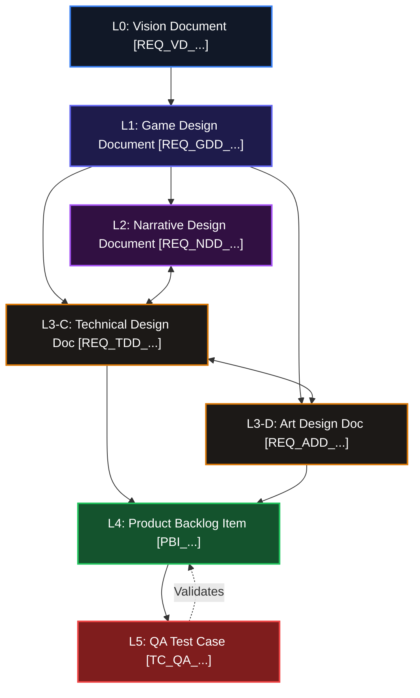

# LUDUS MAGNUS AUTOMATED LIFECYCLE MONITORING (ALM) STANDARDS
## Document Code: LM_ALM_STD_001
## Version: v1.0:0
## System Status: RELEASED (ASPICE LEVEL 3 COMPLIANT)

---

## 1. COMPLIANCE CONTEXT & ROLE RESPONSIBILITIES

Under ASPICE and V-Model engineering frameworks, all documentation is treated as formal System Requirements, and all codebase commits and test reports are treated as dynamic System Validation Logs. 

The software development process is divided into explicit, domain-specific roles with designated responsibilities and clear documentation boundaries:

*   **Game Director / Product Owner (`@prime`):**
    *   *Domain:* Level 0 (Vizyon Belgesi / VD) and Level 1 (Game Design Document / GDD, Narrative Design Document / NDD).
    *   *Mission:* Sets panteon scope limits, mechanics, and core gameplay math. Protects design integrity and the core loop.
*   **Technical Director / Lead Architect (`@arch`):**
    *   *Domain:* Level 3-C (Technical Design Document / TDD).
    *   *Mission:* Architects memory allocations, Blueprint inheritance rules, C++ classes, and performance margins.
*   **Art & Audio Director (`@virtuoso`):**
    *   *Domain:* Level 3-D (Art & Audio Design Document / ADD).
    *   *Mission:* Orchestrates sprite billboard rendering budgets, audio sample rates, and texture resolutions.
*   **Producer / QA Lead (`@pub`):**
    *   *Domain:* Level 4 (Product Backlog Item / PBI) and Quality Assurance (Test Case / TC_QA).
    *   *Mission:* Governs Acceptance Criteria (AC), Definition of Done (DoD), sprint planning, and test validation.

---

## 2. THE 6-LEVEL GATED REQUIREMENTS HIERARCHY

Every design decision is strictly traceable from the high-level system vision down to the individual code line and verification script:

### Hierarchy Breakdown & Token Format Criteria

1.  **Level 0: Vision Document (`VD.md`)**
    *   *Syntax:* `[REQ_VD_XXX_00]` (where `XXX` represents category codes e.g. `SCP` for Scope, `TEC` for Technical Constraints, `ART` for Visuals).
    *   *Mandatory Elements:* Platform targeting (PC/Steam), FPS standard, target hardware caps, and high-level core loop boundaries.
2.  **Level 1: Game Design Document (`GDD.md`)**
    *   *Syntax:* `[REQ_GDD_XXX_00]` (where `XXX` represents sub-module taxonomy codes: `SYS` for general systems, `CMB` for combat, `ARC` for architecture, `ECO` for economy, `STY` for style).
    *   *Mandatory Elements:* Mathematical loop formulas, player inputs, and exact system configurations.
3.  **Level 2: Narrative Design Document (`NDD.md`)**
    *   *Syntax:* `[REQ_NDD_XXX_00]` (where `XXX` could be `LOR` for lore, `QST` for quests, `DLG` for conversations).
    *   *Mandatory Elements:* Quest nodes, character dialogue sheets, branching choices, and world rules.
4.  **Level 3-C: Technical Design Document (`TDD.md`)**
    *   *Syntax:* `[REQ_TDD_XXX_00]` (where `XXX` represents systems like `SYS`, `CMB`, `ARC`, etc.).
    *   *Mandatory Elements:* Blueprint/C++ class boundaries, memory budgets, garbage collection limits, and data tables.
5.  **Level 3-D: Art & Audio Design Document (`ADD.md`)**
    *   *Syntax:* `[REQ_ADD_XXX_00]` (where `XXX` represents assets like `STY`, `TEX`, `ANM`, `AUD`, `VFX`).
    *   *Mandatory Elements:* Texture size allocations, audio channels limits, and sprite billboard sorting metrics.
6.  **Level 4: Product Backlog Item (`PBI.md` or files under `/PBI/`)**
    *   *Syntax:* `[PBI_XXX]` (where `XXX` is a unique 3-digit numeric index e.g., `[PBI_042]`).
    *   *Mandatory Elements:* Asymmetric story points, Acceptance Criteria (AC), and strict Definition of Done (DoD) markers.
7.  **Level 5: Quality Assurance (`QA.md` or files under `/QA/`)**
    *   *Syntax:* `[TC_QA_XXX_PBIYYY_Z]` (where `XXX` is the module code, `YYY` is the associated PBI digits, and `Z` is a sequential test index, e.g. `[TC_QA_CMB_PBI042_A]`).
    *   *Mandatory Elements:* Prerequisites, execution steps, expected outputs, and status logs (`PASS`, `FAIL`, `BLOCKED`).

---

## 3. RELATIONAL DEPENDENCY & TRACEABILITY MAPPING

A robust lifecycle requires bidirectional traceability (upstream and downstream). Relational connections are declared dynamically by embedding references inside description sections:

*   **Upstream Traceability:** A child requirement must declare its parent requirement token.
    *   *Example:* An L1 Game Design rule references its L0 parent:
        `[REQ_GDD_CMB_01] Character combat relies on 3 distinct attack forms to prevent mechanical fatigue. References: [REQ_VD_SCP_02].`
*   **Downstream Traceability:** PBIs and QA Test Cases must explicitly link to their technical specifications and narratives.
    *   *Example:* A QA Test Case declares the target requirement and PBI being verified:
        `[TC_QA_CMB_PBI042_A] Double Jump Physics. Target: [REQ_TDD_CMB_12], Verifies: [PBI_042].`

---

## 4. GIT BRANCHING & VERSION-COMMIT INTEGRATION

To track code changes directly to system requirements, the developer must adhere to strict git standards:

### Branch Naming Conventions
*   **Development branch:** `develop` or `main`.
*   **Feature branches:** `feature/PBI_XXX-short-description` (e.g., `feature/PBI_042-double-jump`).

### Commit Formatting Rules
Every commit on a feature branch must start with the version-commit milestone notation:
*   `vA.B` indicates the develop-level milestone (e.g. `v0.1` for Sprint 1).
*   `vA.B:C` indicates feature-level progress where `C` is the sequential commit index.

The message must contain the targeted PBI token and the associated requirement token:
*   *Format:* `vA.B:C - [PBI_XXX] - [Commit description] [REQ_TYPE_MOD_ID]`
*   *Example:* `v0.1:04 - [PBI_042] - Added character double jump physics override [REQ_TDD_CMB_12]`

---

## 5. STATIC AUDIT & COMPLIANCE RULES

To pass the Systems Audit, documents must maintain zero architectural errors:
1.  **Orphan Rule:** Every Level 1-3 requirement (GDD, NDD, TDD, ADD) must trace back to at least one L0 parent token. If it has no upstream reference, it is an **Orphan Error**.
2.  **QA Coverage Rule:** Every PBI must have at least one associated `TC_QA` validation test case. A PBI without a test case represents a **QA Test Gap**.
3.  **Stability Rule:** Any test case marked as `FAIL` automatically blocks the parent PBI and any associated downstream releases.
